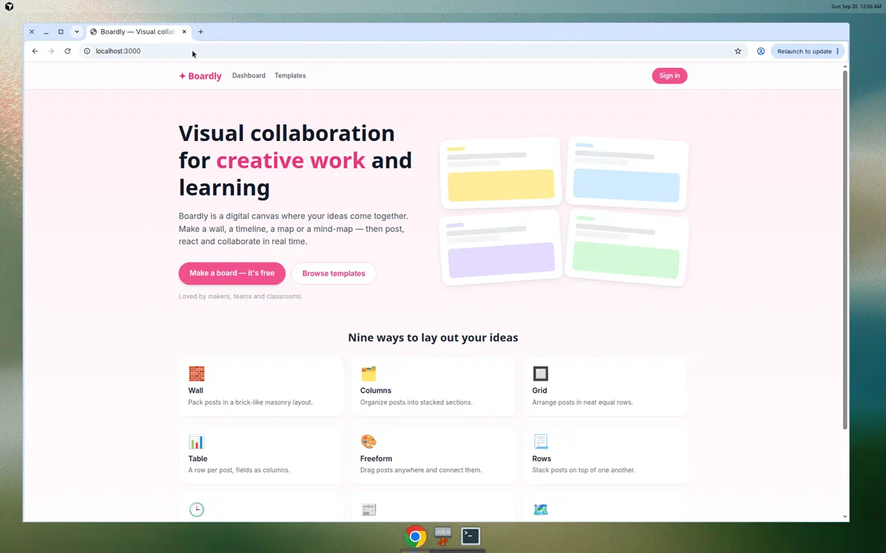
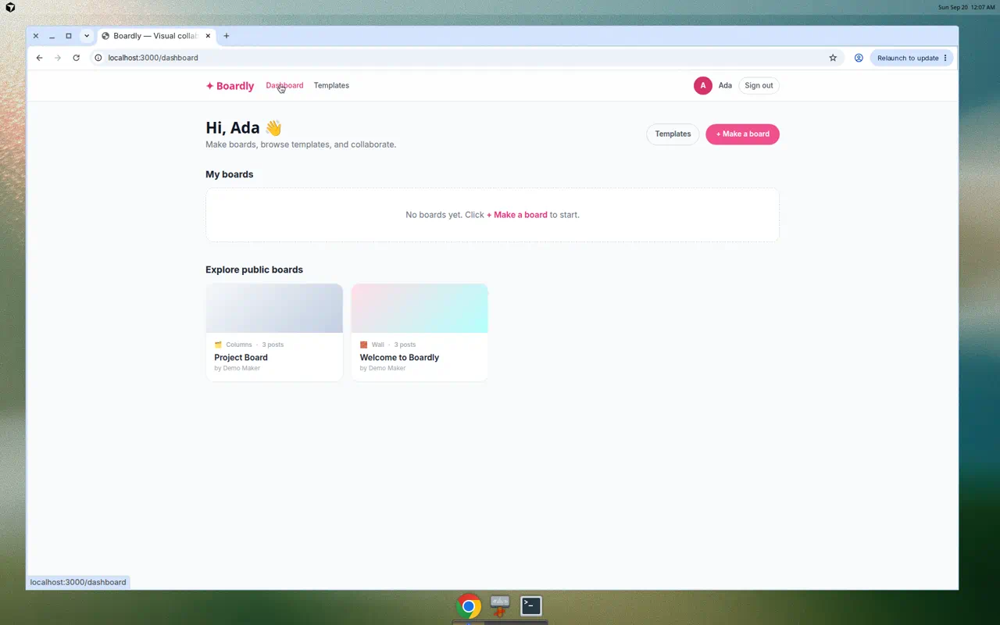
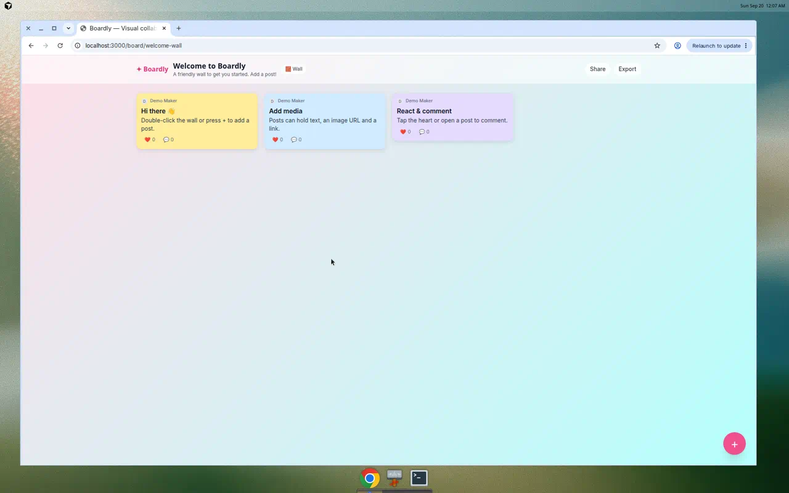
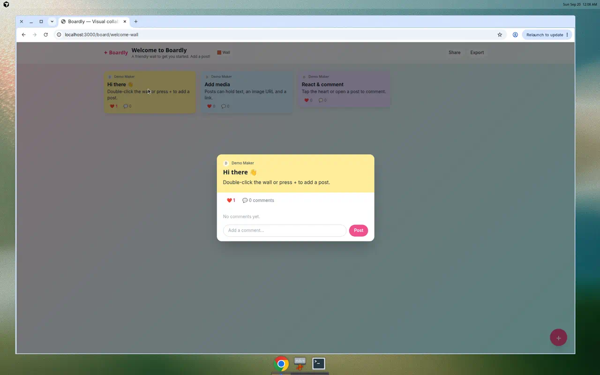
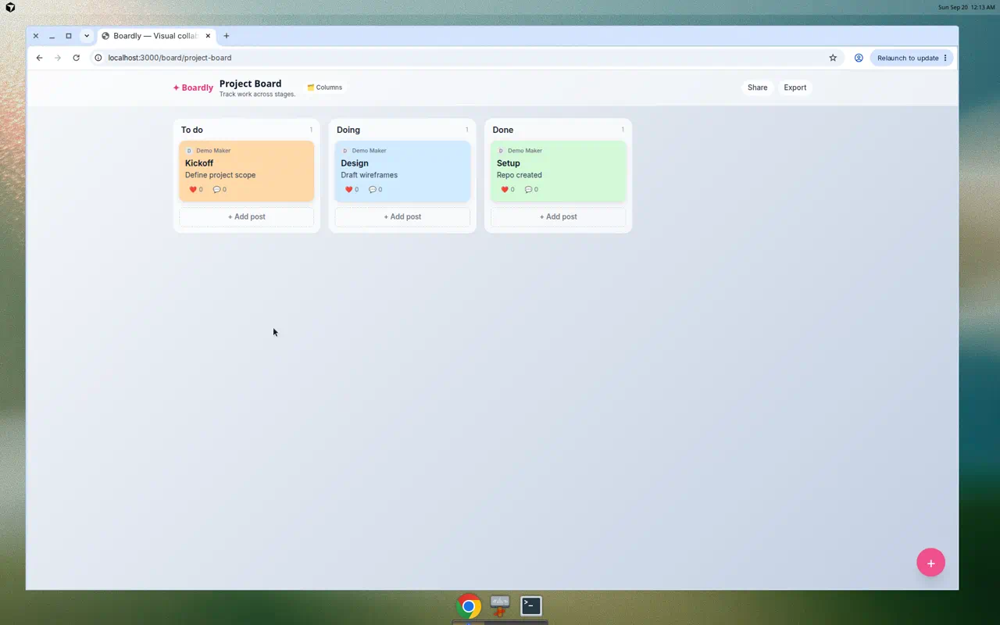
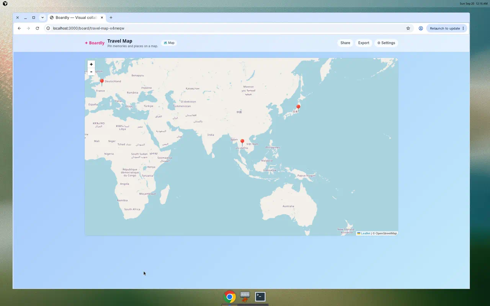
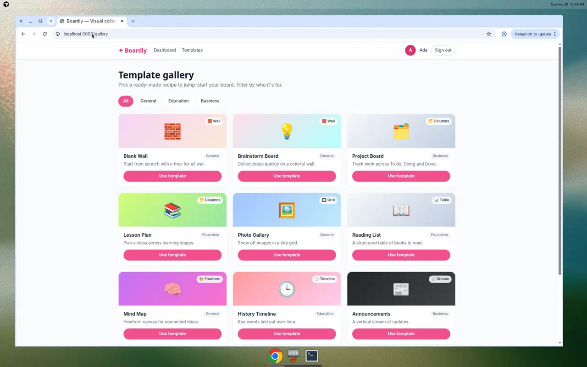
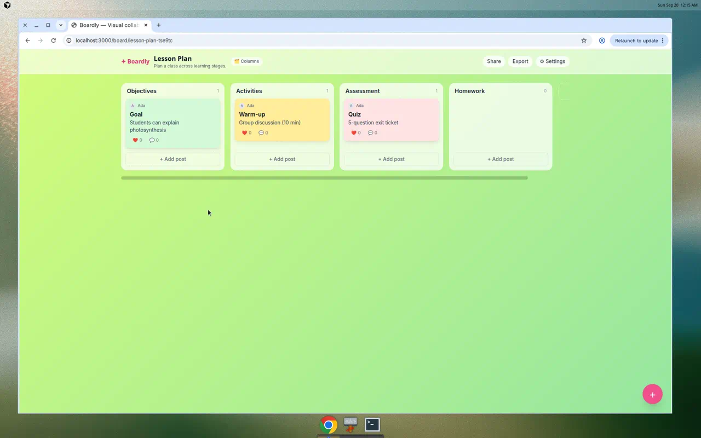

# Boardly — User & Admin Manual

Boardly is a Padlet-style visual collaboration app. Create beautiful boards, add
posts with media, react and comment, and organize ideas in nine different
layouts — walls, columns, timelines, maps and more.

This manual uses screenshots of the running app as a step-by-step guide for both
everyday **users** and board **owners/admins**.

## Contents

- [1. Overview](#1-overview)
- [2. Getting started](#2-getting-started)
- [3. User guide](#3-user-guide)
  - [3.1 Open a board](#31-open-a-board)
  - [3.2 Add a post](#32-add-a-post)
  - [3.3 React and comment](#33-react-and-comment)
  - [3.4 Board formats](#34-board-formats)
  - [3.5 Use a template](#35-use-a-template)
  - [3.6 Share and export](#36-share-and-export)
- [4. Admin / owner guide](#4-admin--owner-guide)
  - [4.1 Create a board](#41-create-a-board)
  - [4.2 Board settings](#42-board-settings)
  - [4.3 Sections and moving posts](#43-sections-and-moving-posts)
  - [4.4 Moderate posts](#44-moderate-posts)
  - [4.5 Delete a board](#45-delete-a-board)
- [5. Run locally](#5-run-locally)
- [6. Notes and limits](#6-notes-and-limits)

---

## 1. Overview

The landing page introduces Boardly and shows the nine layout formats you can
choose from.



---

## 2. Getting started

### Sign in

1. Click **Sign in** at the top-right of any page.
2. Enter a display name (no password — this build uses a lightweight demo
   sign-in) and click **Continue**.
3. Your colored avatar appears at the top-right. You can **Sign out** from the
   same menu.

### The dashboard

After signing in, open **Dashboard** from the top navigation. It has two areas:

- **My boards** — boards you own (empty until you create one).
- **Explore public boards** — public boards from everyone.

Each card shows the format icon, post count and owner. Click a card to open it.



---

## 3. User guide

### 3.1 Open a board

Click any board card. A board opens on its wallpaper with its posts. The header
shows the title, format badge, and **Share / Export** (and **Settings** for
owners).



### 3.2 Add a post

1. Click the pink circular **+** button at the bottom-right.
2. Fill in a **subject** and **body**.
3. Optionally add an **image URL** and a **link URL**.
4. Pick a **card color**, then click **Save**.

The new post appears immediately on the board.


> Tip: on a **Freeform** board you can also double-click any empty space to add a
> post at that spot.

### 3.3 React and comment

- Click the reaction button (❤️ / 👍 / ⭐ / 💯 depending on the board) on a card
  to react; the count updates instantly. Click again to remove your reaction.
- Click a card to open its **detail view**, where you can read the full post,
  react, and add **comments**.



Boards refresh automatically every few seconds, so posts, reactions and comments
from other people appear without reloading.

### 3.4 Board formats

Boardly supports nine formats. Owners can switch the format at any time in
Settings.

| Format | What it's for |
| --- | --- |
| 🧱 **Wall** | Brick-like masonry layout |
| 🗂️ **Columns** | Posts grouped into sections (like a Kanban board) |
| 🔲 **Grid** | Equal-sized cards in neat rows |
| 📊 **Table** | One row per post, fields as columns |
| 🎨 **Freeform** | Drag posts anywhere on a canvas |
| 📃 **Rows** | Posts stacked top-to-bottom |
| 🕒 **Timeline** | Chronological layout with a connector line |
| 📰 **Stream** | A vertical feed of full-width posts |
| 🗺️ **Map** | Posts pinned to locations on a map |

**Columns** groups posts into sections:



**Map** pins posts to real locations (OpenStreetMap). Click anywhere on the map
to drop a new pin.



### 3.5 Use a template

1. Open **Templates** from the top navigation.
2. Filter by **General / Education / Business**.
3. Click **Use template** on any card to create a ready-made board.



The template pre-fills the board's format, wallpaper, sections and starter posts.



### 3.6 Share and export

- **Share** — copies the board link to your clipboard so others can open it.
- **Export** — downloads the board (title, settings, sections, posts, comments)
  as a JSON file.

---

## 4. Admin / owner guide

You are the **owner/admin** of any board you create. Owners get extra controls.

### 4.1 Create a board

1. On the Dashboard (or from the top bar), click **+ Make a board**.
2. Enter a title, choose a **format** and a **wallpaper**, then **Create board**.
3. You are taken straight to your new board. (You can also start from a
   [template](#35-use-a-template).)

### 4.2 Board settings

Click **⚙ Settings** in the board header (owners only). From the settings panel
you can change:

- **Title** and **description**
- **Format** — switch between any of the nine layouts at any time
- **Wallpaper** — pick from nine backgrounds
- **Reactions** — choose the reaction type (Like / Vote / Star / Grade) or turn
  reactions off
- **Comments** — allow or disable commenting
- **Visibility**:
  - **Public** — anyone with the link, and shown in Explore
  - **Secret** — anyone with the link, hidden from Explore
  - **Private** — only you can open it

Click **Save settings** to apply.

### 4.3 Sections and moving posts

On a **Columns** board:

- Click **+ Add section** to create a new column (owners only).
- **Add post** at the bottom of any column to post directly into it.
- **Move a post between columns** in either of two ways:
  - drag a card from one column and drop it on another, or
  - open the post and pick a new column from the **Section** dropdown
    (reliable on any device).

### 4.4 Moderate posts

Open any post's detail view. As the owner you can **Edit** (change subject, body,
media, link, color) or **Delete** the post. Anyone can react and comment when
those options are enabled.

### 4.5 Delete a board

On the Dashboard, hover a board you own and click **Delete** on the card. This
permanently removes the board and all of its posts, comments and reactions.

---

## 5. Run locally

```bash
cd padlet-clone
npm install
npm run setup   # prisma generate + db push + seed demo data
npm run dev     # open http://localhost:3000
```

The app uses SQLite, so no external database is required.

---

## 6. Notes and limits

- **Real-time** updates use polling (~every 3 seconds), not WebSockets. True
  multi-cursor/CRDT collaboration is future work.
- **Sign-in** is a demo display-name login — there are no passwords or external
  providers (Google/Microsoft/Apple) yet.
- **AI board generation** is not implemented yet.
- Boardly is an independent, Padlet-inspired demo. It uses its own branding and
  does not include any Padlet assets or trademarks.
